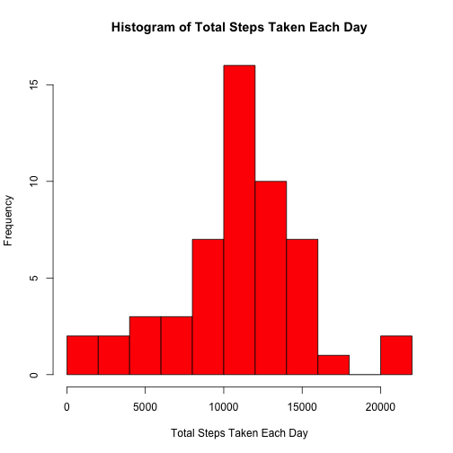
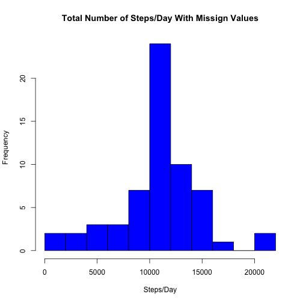
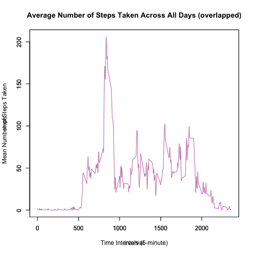
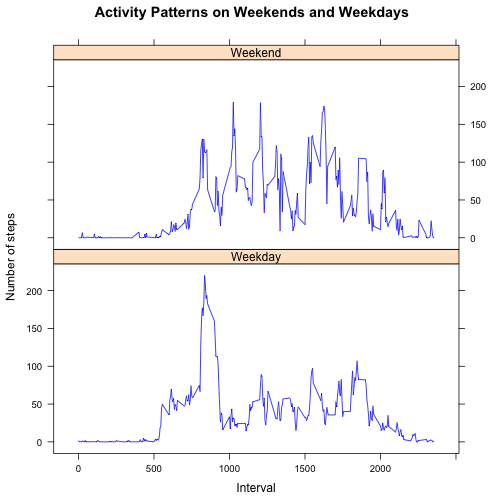

# Reproducible Research: Peer Assessment 1
---
title: "Reproducible Research Peer Assessment 1"
author: "José Enrique Álvarez"
date: "14 de agosto de 2014"
output: html_document
---

## Loading and preprocessing the data

* Loading the Data.


```r
activity <- read.csv("Data/activity.csv")
```

* Processing and Transforming the Data


```r
activity$date <- as.Date(activity$date,"%Y-%m-%d")
activityClean <- na.omit(activity)
```

## What is mean total number of steps taken per day?


```r
totalSteps<-aggregate(steps~date,data=activityClean,sum)
```

* Histogram of the Total Number of Steps Taken Each Day


```r
hist(totalSteps$steps,col="red",
     xlab="Total Steps Taken Each Day",ylab="Frequency",breaks=10,
     main="Histogram of Total Steps Taken Each Day")
```

 

* **Mean** total number of steps taken per day


```r
mean(totalSteps$steps)
```

```
## [1] 10766
```

* **Median** total number of steps taken per day


```r
median(totalSteps$steps)
```

```
## [1] 10765
```

## What is the average daily activity pattern?
* Making a time series plot of type = "l"  of the 5-minute interval (x-axis) and the average number of steps taken, averaged across all days (y-axis)


```r
meanSteps<-aggregate(steps~interval,data=activityClean,mean,na.rm=TRUE)
plot(steps~interval,data=meanSteps,type="l",
     xlab="Time Intervals (5-minute)", 
     ylab="Mean Number of Steps Taken", 
     main="Average Number of Steps Taken Across All Days",
     col="red")
```

 

* Which 5-minute Interval Contains the Maximum Number of Steps?


```r
meanSteps[which.max(meanSteps$steps),]$interval
```

```
## [1] 835
```

## Imputing missing values

* Number of Missing Values


```r
sum(is.na(activity$steps))
```

```
## [1] 2304
```

* Filling Missing Values


```r
missingSteps <- numeric()
for(i in 1:nrow(activity)) {
      rd <- activity[i,]
      if (is.na(rd$steps)) {
            steps <- subset(meanSteps,interval==rd$interval)$steps
            } else {
                  steps <- rd$steps
                  }
      missingSteps <- c(missingSteps,steps)
      }
```

* New Dataset with the Missing Data Filled In.


```r
activityMissingSteps <- activity
activityMissingSteps$steps <- missingSteps
```

* Histogram of the total number of steps taken each day.


```r
imp_steps_per_day <- aggregate(steps~date, data=activityMissingSteps,sum)

hist(imp_steps_per_day$steps,  
     main="Total Number of Steps/Day With Missign Values",breaks=10,
     xlab="Steps/Day", col="blue")
```

 

* **Mean** total number of steps taken per day


```r
mean(imp_steps_per_day$steps)
```

```
## [1] 10766
```

* **Median** total number of steps taken per day


```r
median(imp_steps_per_day$steps)
```

```
## [1] 10766
```

* Comparing the result w/ and w/o missing values. Using overlapped histogrms 


```r
par(mfrow=c(1,3)) 
hist(totalSteps$steps,col=rgb(0,0,1,0.5),breaks=10,
     xlab="Total Steps Taken Each Day",ylab="Frequency",
     main="Data w/o missing values")

hist(imp_steps_per_day$steps, col=rgb(1,0,0,0.5),breaks=10, 
     xlab="Total Steps Taken Each Day",ylab="Frequency",
     main="Data w/ missing values imputed")

hist(totalSteps$steps,col=rgb(0,0,1,0.5),breaks=10,
     xlab="Total Steps Taken Each Day",ylab="Frequency",
     main="Overlapping Histogram")

hist(imp_steps_per_day$steps, col=rgb(1,0,0,0.5),breaks=10, add=T)
box()
```

 

* Comparing the result w/ and w/o missing values. Using lines. No difference.


```r
meanTotalSteps<-aggregate(steps~interval,data=activityMissingSteps,mean,na.rm=TRUE)

par(mfrow=c(1,1))

plot(steps~interval,data=meanSteps,type="l",
     xlab="Time Intervals (5-minute)", 
     ylab="Mean Number of Steps Taken", 
     main="Average Number of Steps Taken Across All Days (overlapped)",
     col=rgb(0,0,1,0.5))

par(new=T)
plot(steps~interval,data=meanTotalSteps,type="l",
     col=rgb(1,0,0,0.5))
```

 

```r
par(new=F)
```

## Are there differences in activity patterns between weekdays and weekends?

* Create a new factor variable ("weekday", "weekend")


```r
Day <- weekdays(activityMissingSteps$date)
activityMissingSteps$day_type <- ifelse(Day == "sabado" | Day == "domingo","Weekend", "Weekday")
```

* Plot the 5-minute interval (x-axis) and the average number of steps taken, averaged across all weekday days or weekend days (y-axis). 


```r
meanSteps.imputed <- aggregate(activityMissingSteps$steps,
                               by=list(activityMissingSteps$interval,activityMissingSteps$day_type),mean)
names(meanSteps.imputed) <- c("interval","day_type","steps")

library(lattice)
xyplot(steps~interval | day_type, meanSteps.imputed,type="l",layout=c(1,2),
       xlab="Interval",ylab = "Number of steps",
       main="Activity Patterns on Weekends and Weekdays",col = "blue")
```

 
